<h2>Cas 1</h2>

    <b>Class Entier naturel</b>
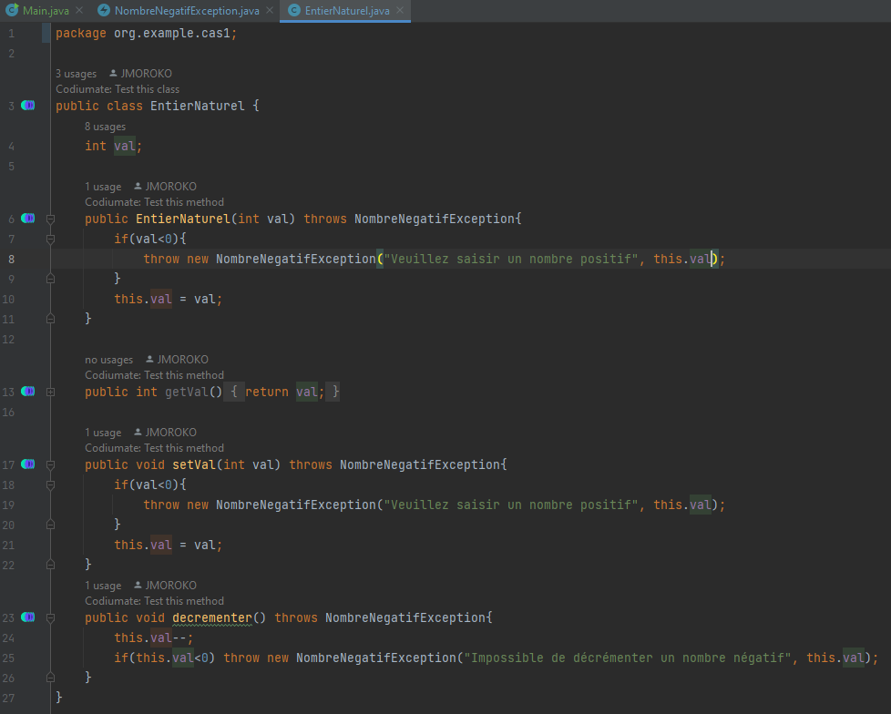
    <b>Class NombreNegatifException</b>
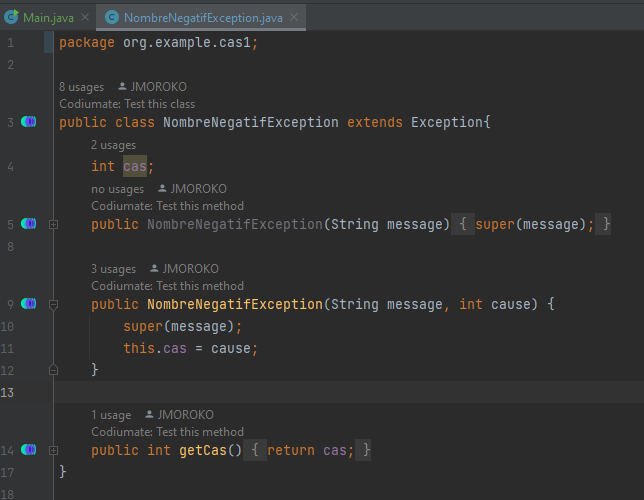
    <b>Class Main</b>
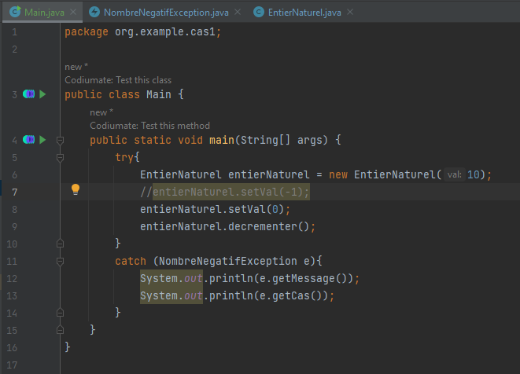
    <b>Résultats de test</b>
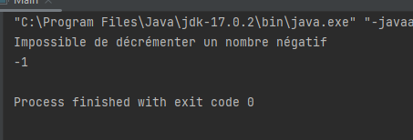

<h2>Cas 2</h2>

<b>Class compte bancaire</b>
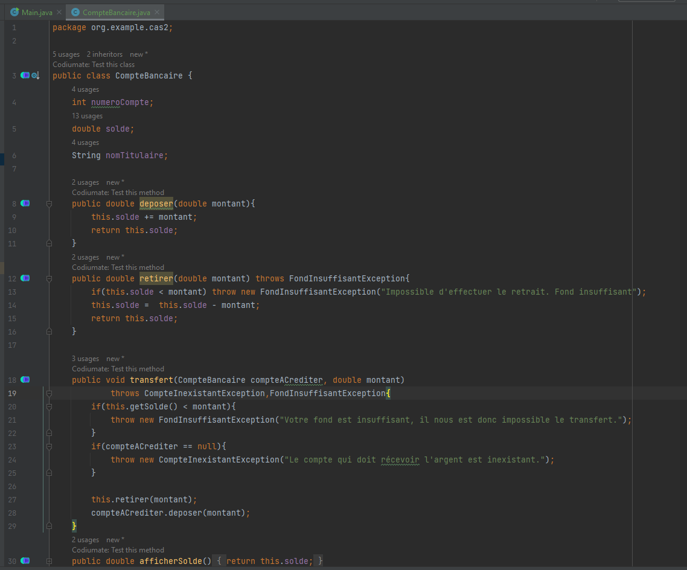
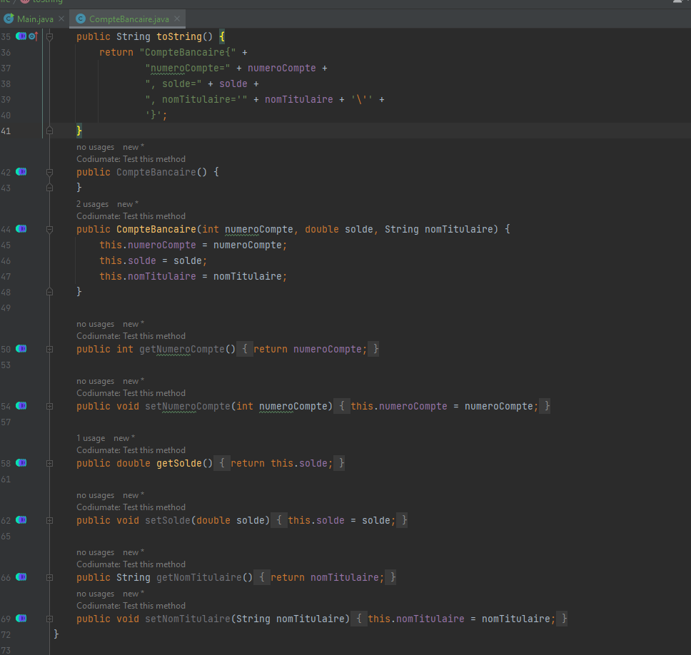
<b>Class compte courant</b>
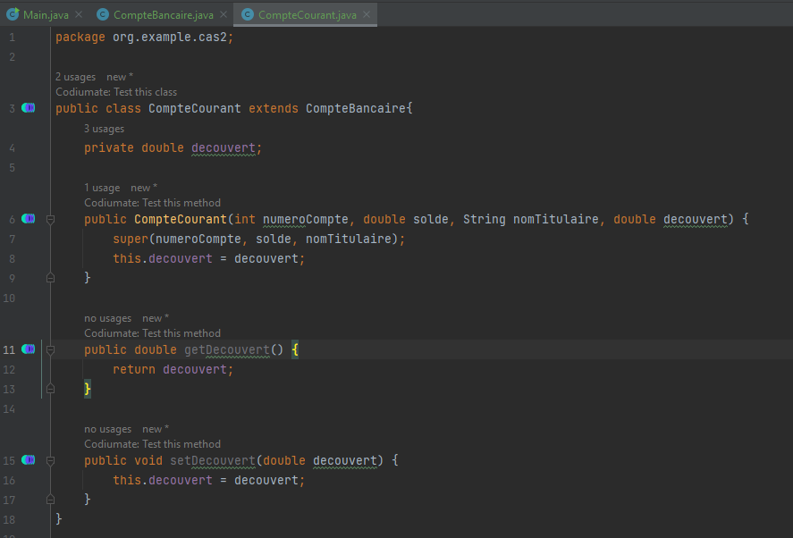
<b>Class compte epargne</b>
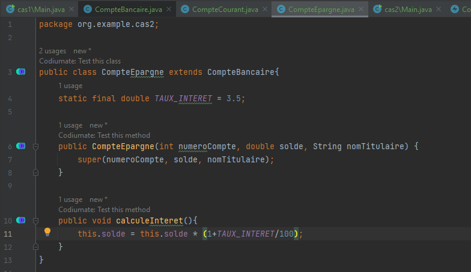
<b>Class CompteInexistantException</b>
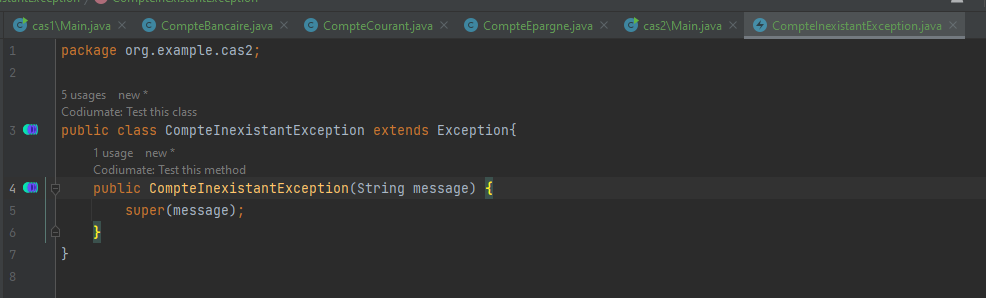
<b>Class FondInsuffisantException</b>
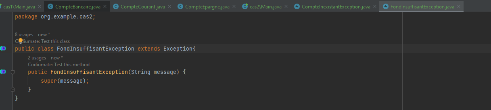
<b>Class Main</b>
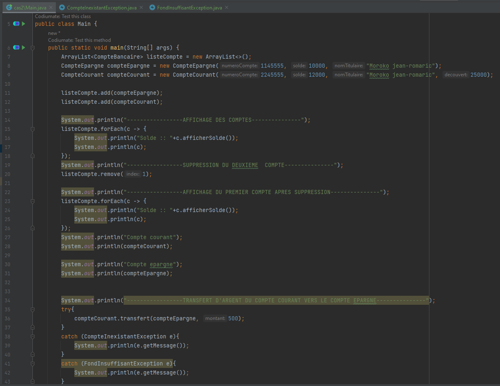
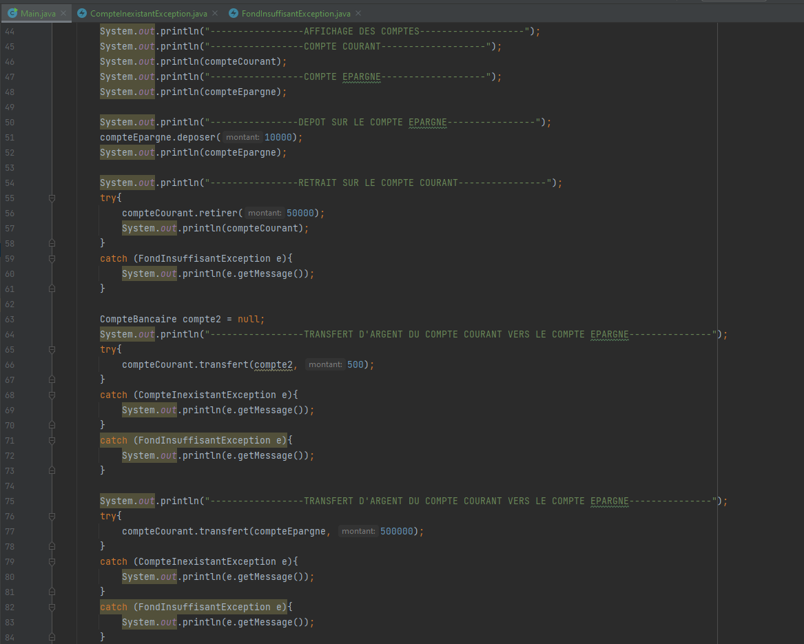
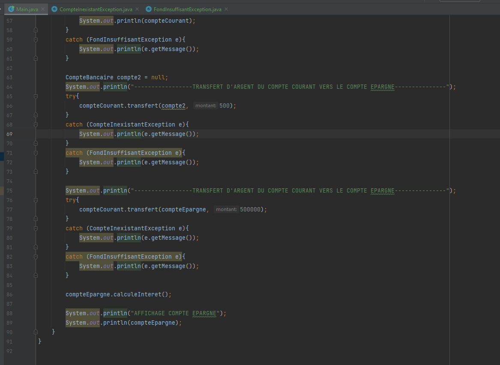
<b>Resultat test</b>
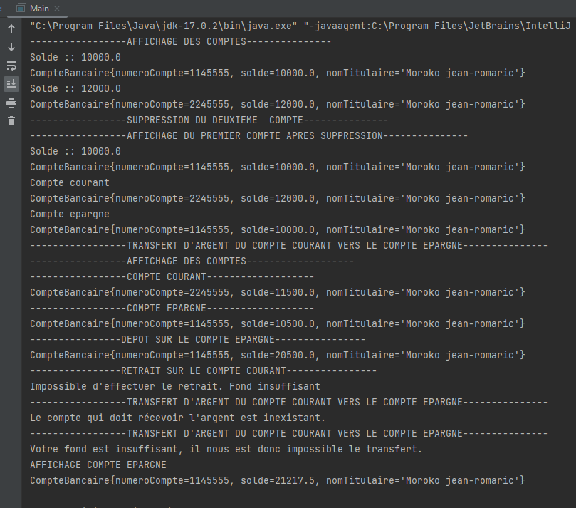

